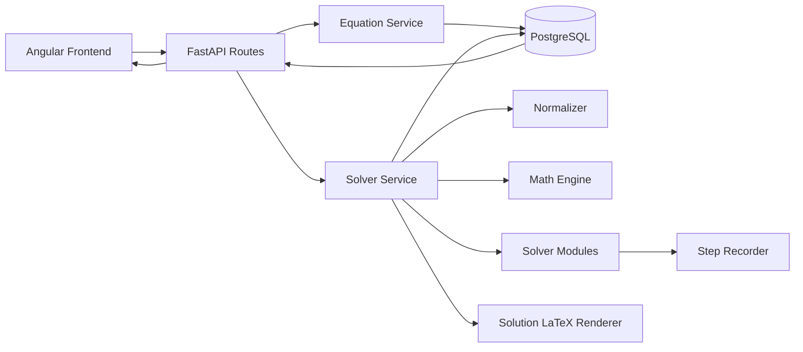
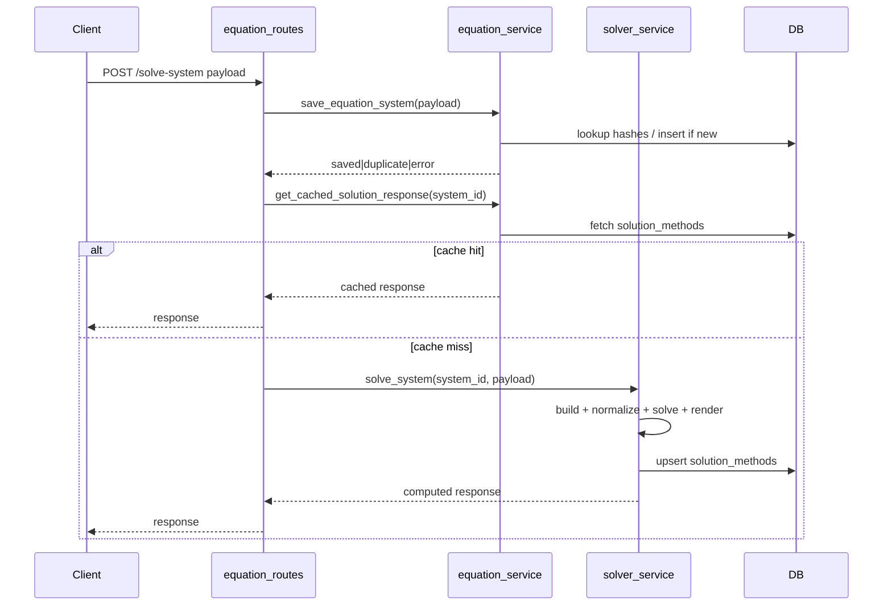
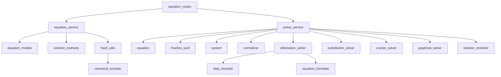

# Technical Architecture Report — Linear Equation Solver

## 1. Repository Structure

```text
linear-equation-solver/
├── backend/
│   ├── api_main.py
│   ├── database.py
│   ├── init_db.py
│   ├── runserver.py
│   ├── routes/
│   │   └── equation_routes.py
│   ├── services/
│   │   ├── equation_service.py
│   │   └── solver_service.py
│   ├── schemas/
│   │   └── equation_schema.py
│   ├── models/
│   │   ├── equation_models.py
│   │   └── solution_methods.py
│   ├── normalization/
│   │   └── normalizer.py
│   ├── math_engine/
│   │   ├── fraction_surd.py
│   │   ├── equation.py
│   │   └── system.py
│   ├── solver/
│   │   ├── elimination_solver.py
│   │   ├── substitution_solver.py
│   │   ├── cramer_solver.py
│   │   └── graphical_solver.py
│   ├── latex/
│   │   ├── equation_formatter.py
│   │   └── solution_renderer.py
│   ├── utils/
│   │   ├── canonical_encoder.py
│   │   ├── hash_utils.py
│   │   ├── equation_numbering.py
│   │   ├── step.py
│   │   └── step_recorder.py
│   └── graph/
│       └── graph_plotter.py
├── frontend/app/src/app/
│   ├── services/
│   │   ├── equation-api.service.ts
│   │   └── solver-state.service.ts
│   ├── models/
│   │   ├── equation.model.ts
│   │   ├── solver-response.model.ts
│   │   └── term.model.ts
│   ├── pages/solver-page/
│   ├── components/
│   └── utils/latex-generator.ts
├── docs/
│   └── linear_equation_solver_architecture_blueprint.docx
├── README.md
└── requirements.txt
```

### Layer responsibilities
- **Routes (FastAPI)**: HTTP contract and request/response boundary.
- **Services**: orchestration, persistence, duplicate detection, solver invocation.
- **Math engine**: symbolic domain objects (`FractionSurd`, `Equation`, `EquationSystem`).
- **Normalization**: algebraic canonicalization before solving.
- **Solver modules**: elimination, substitution, Cramer, graphical methods.
- **LaTeX layer**: conversion of equations and method outputs into verbosity-tiered LaTeX.
- **Models/DB**: stored systems and per-method artifacts.
- **Frontend service/state layer**: API communication and page-level reactive state.

---

## 2. Execution Pipeline

### POST `/solve-system`
1. **Route ingestion**: `equation_routes.solve_equation_system` receives `SolveRequestSchema`, adapts payload with `_normalize_payload`.
2. **System persistence gate**: calls `save_equation_system` to validate non-identical equations, compute hashes, and either save or detect duplicate.
3. **Cache check**: route calls `get_cached_solution_response`; if all four method rows exist (`elimination`, `substitution`, `cramer`, `graphical`), it returns cached payload directly.
4. **Solver service orchestration**: `solver_service.solve_system` builds `FractionSurd` terms → `Equation` objects → `EquationSystem`.
5. **Normalization**: `Normalizer.normalize` removes integer denominators via LCM, reduces by GCD when integer-only, and normalizes sign orientation.
6. **Method execution**:
   - `EliminationSolver.solve()` (with step recorder).
   - `SubstitutionSolver.solve()`.
   - `CramerSolver.solve()`.
   - `GraphicalSolver.generate_tables()`.
7. **Rendering**: `SolutionLatexRenderer.render()` generates `latex_detailed`, `latex_medium`, `latex_short` for each method.
8. **Persistence of computed artifacts**: `_upsert_method_record` writes/updates one `solution_methods` row per method.
9. **Response**: returns `solution`, `methods`, and `graph`.

### GET `/systems`
1. Route `equation_routes.get_systems` calls `equation_service.get_saved_systems`.
2. Service loads `equation_systems` + `solution_methods`, groups methods by `system_id`.
3. Builds frontend rows with `has_solution` and optional `stored_response` (assembled from stored method LaTeX/solution/graph data).

---

## 3. Module Responsibility Map

- **Equation parsing/input adaptation**: `backend/routes/equation_routes.py` (`_normalize_payload`), `backend/schemas/equation_schema.py` (supports both `terms[]` and `term1/term2`).
- **Symbolic algebra primitives**: `backend/math_engine/fraction_surd.py`, `backend/math_engine/equation.py`, `backend/math_engine/system.py`.
- **Normalization**: `backend/normalization/normalizer.py`.
- **Solving algorithms**: `backend/solver/*.py`.
- **Step recording**: `backend/utils/step_recorder.py`, consumed primarily by elimination solver.
- **LaTeX generation**: `backend/latex/equation_formatter.py`, `backend/latex/solution_renderer.py`.
- **Database persistence**: `backend/models/*.py`, `backend/services/equation_service.py`, `backend/services/solver_service.py`.
- **Hashing + duplicate detection**: `backend/utils/hash_utils.py`, `backend/utils/canonical_encoder.py`, invoked from `save_equation_system`.
- **Frontend communication**: `frontend/app/src/app/services/equation-api.service.ts` and app state coordination in `solver-state.service.ts`.

---

## 4. Solver Implementation Analysis

### Elimination
- Implements **strategy detection** (`DIRECT`, `CROSS`, `LCM`) using coefficient comparison/sign rules.
- Chooses elimination variable by comparing multiplication counts from LCM scaling (`choose_variable`).
- Applies conditional equation multiplication (skips when multiplier is 1).
- Records pedagogical steps (`text`, `operation`, `equation`, `vertical_elimination`) via `StepRecorder`.
- Returns final solution from SymPy `solve` after procedural step generation.

### Substitution
- Builds SymPy equations from normalized system.
- Attempts deterministic isolation priority (prefer solving for `x` in eq1, then fallbacks).
- Substitutes isolated expression into the other equation.
- Returns map `{x: value, y: value}` or `[]` for non-unique/no solution scenarios.
- No detailed step recorder integration yet.

### Determinant / Cramer
- Computes determinants `D`, `Dx`, `Dy`.
- Returns `"No unique solution"` when `D == 0`.
- Else returns `x = Dx/D`, `y = Dy/D`.
- Produces values but not method-step trace.

### Graphical
- For each equation, scans integer `x ∈ [-8, 8]`, computes `y`, prefers integer points in range.
- If insufficient points, appends intercepts `(c/a, 0)` and `(0, c/b)` as fallback.
- Returns up to 3 points per equation.

---

## 5. Architecture Issues or Legacy Code

1. **Canonicalization mismatch risk**: `canonicalize_equation` hashes `term1/term2` keys, while route normalization can emit only `terms[]` unless original payload included explicit `term1/term2`; this can weaken duplicate detection consistency.
2. **Variable-name mismatch in Cramer path**: `CramerSolver` returns keys `"x"`, `"y"` regardless of user-selected variable symbols; solver service maps with `.get("x")/.get("y")`, which can decouple from arbitrary variable names.
3. **Frontend model drift**: frontend `SolverResponse.methods` type expects step arrays for multiple methods, but backend currently returns LaTeX blobs for substitution/cramer/graphical and only elimination steps.
4. **Partially unused modules**:
   - `backend/graph/graph_plotter.py` not in FastAPI flow.
   - `backend/latex/math_to_latex.py` not in current orchestration.
5. **Legacy/duplicate artifacts in repo root**: existing `TECHNICAL_REPORT*.md`, `fix.patch`, and naming typo `backend/math_engine/_init_.py` suggest historical residue.
6. **Schema migration strategy debt**: `ensure_solution_methods_schema` performs runtime DDL rather than managed migrations.

---

## 6. Database Architecture

### `equation_systems`
- Columns: `id`, `variables(JSONB)`, `equation1(JSONB)`, `equation2(JSONB)`, `equation_hash`, `system_hash`, `created_at`.
- `system_hash` is unique/indexed; acts as exact-duplicate gate.

### `solution_methods`
- Columns: `id`, `system_id(FK)`, `method_name`, `latex_detailed`, `latex_medium`, `latex_short`, `solution_json(JSONB)`, `graph_data(JSONB)`, `created_at`.
- One row per solving method per system, updated via service-level upsert.

### Persistence behavior
- `POST /solve-system` persists system first, then writes 4 method rows.
- `GET /systems` retrieves systems and joins methods in memory, exposing `stored_response` when data exists.

---

## 7. Caching and Duplicate Detection

### Hashes
- **`equation_hash`**: canonicalized equations only; ignores variable names; equations are sorted before hashing.
- **`system_hash`**: canonicalized equations + sorted variable list; detects exact system duplicates.

### Duplicate prevention flow
- If same `system_hash` exists → status `duplicate` and reuse id.
- If `equation_hash` exists but different variables → status `variable_conflict`.
- Else persist as new system.

### Solver result caching
- Implemented as **database-backed cache** in `solution_methods`.
- Route checks `get_cached_solution_response`; if all required methods exist, solver computation is skipped.
- If any method missing, full recomputation occurs.

---

## 8. Normalization System

`Normalizer` applies equation-level transforms:
1. Convert each coefficient to SymPy expression.
2. Run `sp.together` to combine rational terms.
3. Collect **integer denominators** and multiply all coefficients by LCM to clear them.
4. If all coefficients become integers, divide by global GCD.
5. Force sign normalization: make leading coefficient positive (or second coefficient if leading is zero).

This normalization is applied to both equations before invoking any solver.

---

## 9. Current Project Status

### Completed
- FastAPI backend with save/solve/list/delete endpoints.
- SQLAlchemy persistence for systems + per-method results.
- Implemented solvers: elimination, substitution, Cramer, graphical.
- Multi-verbosity LaTeX rendering service.
- Angular UI with equation builder, saved systems list, and solution panel.

### Partially implemented
- Pedagogical step tracking is robust for elimination only; other methods mostly summary-level.
- Frontend displays elimination steps and limited graphical info; substitution/cramer currently shown as “planned” view path.
- Payload compatibility logic supports mixed legacy/new formats but introduces edge-case complexity.

### Missing or immature
- Formal migration framework (Alembic or equivalent).
- Comprehensive test suite (backend unit/integration + frontend e2e).
- Strict API schema/versioning and typed shared contracts.
- Production hardening (auth/rate-limit/structured observability).

---

## 10. Technical Debt and Risks

1. **Contract inconsistency risk** between backend payload shapes and frontend TypeScript interfaces.
2. **Duplicate detection correctness risk** due to canonicalization dependence on `term1/term2` keys.
3. **Runtime schema mutation risk** (`ensure_solution_methods_schema`) in multi-instance deployments.
4. **Limited validation depth** for mathematical edge cases (degenerate systems, malformed symbolic terms).
5. **Sparse automated tests** increases regression risk across solver math and rendering pipelines.
6. **Mixed legacy/current modules** increases onboarding complexity and maintenance cost.
7. **CORS open wildcard** (`allow_origins=["*"]`) is acceptable for dev but risky for production.

---

## 11. Architecture Diagrams

### 11.1 System Architecture



### 11.2 API Execution Flow (`POST /solve-system`)



### 11.3 Backend Module Dependency Graph



---

## 12. Final Architecture Assessment

### Maturity
- **Architecture maturity: Medium.** Clear modular separation exists (route/service/solver/render/persistence), and symbolic computation goals are reflected in implementation.

### Stability
- **Codebase stability: Medium-Low.** Core flow works conceptually, but API contracts and canonicalization inconsistencies create fragility.

### Production readiness
- **Current readiness: Limited (pre-production).** Lacks migration discipline, robust validation/test depth, and production-grade configuration hardening.

### Recommended next steps
1. Introduce strict shared contracts (OpenAPI-first + generated TS types).
2. Refactor canonicalization to consume normalized `terms[]`/`term1/term2` consistently.
3. Add Alembic migrations; remove runtime schema-alter logic.
4. Expand method-step modeling so substitution/cramer have structured pedagogical steps.
5. Build automated test matrix:
   - solver correctness tests (symbolic edge cases)
   - API integration tests
   - frontend contract tests.
6. Archive or remove legacy/dead modules; standardize package init naming (`__init__.py`).
7. Lock production CORS/DB configs and add observability (structured logs, metrics, trace IDs).
