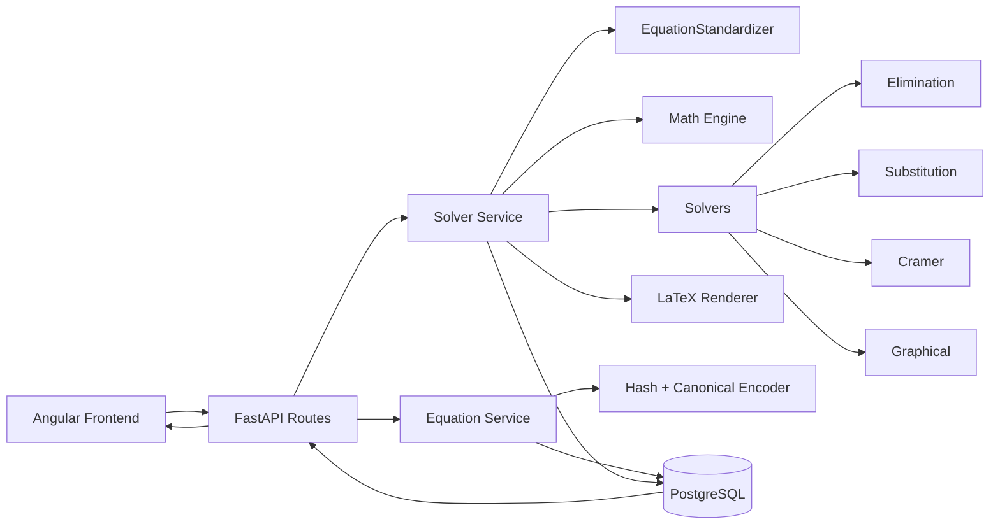
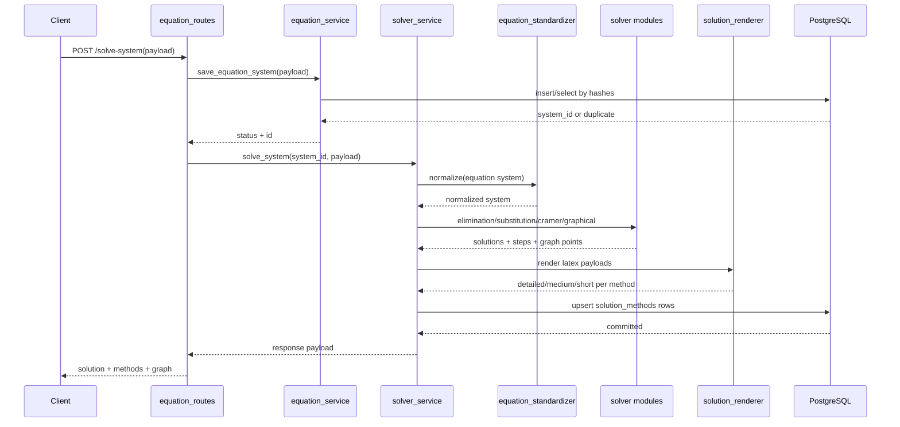
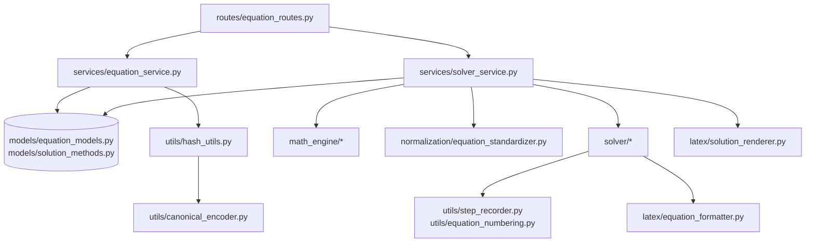

# TECHNICAL REPORT V2 — Linear Equation Solver

## Scope and Method
This report documents the **current repository architecture and implementation status** after refactoring. The analysis is based on repository structure, backend/frontend source modules, and project documentation (`README.md` and `docs/linear_equation_solver_architecture_blueprint.docx`).

---

## 1) Repository Structure (Current Architecture Map)

```text
linear-equation-solver/
├── backend/
│   ├── api_main.py                # FastAPI application entrypoint used by runserver
│   ├── database.py                # SQLAlchemy engine/session/base + schema backfill helper
│   ├── init_db.py                 # manual DB table initialization utility
│   ├── routes/
│   │   └── equation_routes.py     # HTTP endpoints for save/solve/list/delete systems
│   ├── services/
│   │   ├── equation_service.py    # dedupe, hashing, persistence, retrieval assembly
│   │   └── solver_service.py      # normalization + solver orchestration + latex + DB writes
│   ├── normalization/
│   │   └── equation_standardizer.py  # canonical algebraic standardization
│   ├── math_engine/
│   │   ├── fraction_surd.py       # symbolic fraction/surd representation
│   │   ├── equation.py            # symbolic equation model
│   │   └── system.py              # two-equation container model
│   ├── solver/
│   │   ├── elimination_solver.py  # elimination method + step recorder
│   │   ├── substitution_solver.py # substitution solver
│   │   ├── cramer_solver.py       # determinant/Cramer solver
│   │   ├── graphical_solver.py    # graph plotting points generation
│   │   ├── elimination_strategy.py# legacy strategy helper (largely redundant)
│   │   └── solver_controller.py   # legacy method dispatcher (currently inconsistent)
│   ├── latex/
│   │   ├── solution_renderer.py   # main multi-verbosity LaTeX rendering pipeline
│   │   ├── equation_formatter.py  # symbolic equation string formatting
│   │   ├── latex_generator.py     # legacy line-by-line latex converter
│   │   ├── latex_step_renderer.py # legacy step-to-latex renderer
│   │   ├── latex_formatter.py     # small sympy latex wrapper
│   │   ├── vertical_operation_formatter.py # legacy vertical formatting utility
│   │   └── math_to_latex.py       # low-level conversion utility
│   ├── models/
│   │   ├── equation_models.py     # EquationSystem SQLAlchemy model
│   │   ├── solution_methods.py    # SolutionMethod SQLAlchemy model
│   │   ├── coefficient.py         # legacy symbolic model duplicate
│   │   ├── equation.py            # legacy equation model duplicate
│   │   └── step.py                # legacy step model duplicate
│   ├── utils/
│   │   ├── hash_utils.py          # equation/system hashing
│   │   ├── canonical_encoder.py   # canonical payload encoding for hashes
│   │   ├── step_recorder.py       # structured step capture
│   │   ├── step.py                # current step object
│   │   └── equation_numbering.py  # equation numbering helper
│   └── graph/
│       └── graph_plotter.py       # matplotlib plotting helper (not in API pipeline)
├── frontend/
│   └── app/
│       ├── src/app/components/    # equation builder, method selection, saved systems, etc.
│       ├── src/app/services/      # API service + client state store
│       ├── src/app/models/        # response and equation typing
│       └── src/app/utils/         # client latex string builder
├── docs/
│   └── linear_equation_solver_architecture_blueprint.docx
├── README.md
├── TECHNICAL_REPORT.md            # previous report
├── main.py                        # legacy script entrypoint (stale imports)
└── requirements.txt
```

### Directory Responsibilities
- **backend/routes**: request-level API contract.
- **backend/services**: business orchestration and persistence composition.
- **backend/normalization**: standard form transformations before solving.
- **backend/math_engine**: symbolic algebra domain models.
- **backend/solver**: algorithmic method implementations.
- **backend/latex**: pedagogical rendering and verbosity-specific output.
- **backend/models**: database schema definitions (plus legacy duplicates).
- **backend/utils**: hashing, canonicalization, step capture, helpers.
- **frontend/app**: Angular UI for equation construction, solve requests, and result viewing.

---

## 2) Execution Pipeline (Observed Runtime Path)

### Intended runtime flow
1. **API Request** (`POST /solve-system`) arrives at `equation_routes.solve_equation_system`.
2. Route first calls `save_equation_system` (dedupe/validation/persist system row).
3. Route then calls `solve_system` with resolved `system_id`.
4. `solve_system` converts incoming JSON terms into `FractionSurd` and `Equation` objects.
5. `EquationStandardizer.standardize` standardizes equations (LCM denominator clearing, GCD reduction, sign normalization); returns system and steps.
6. Solver methods execute:
   - elimination (step-based)
   - substitution
   - Cramer/determinant
   - graphical points generation
7. `SolutionLatexRenderer` generates `latex_detailed`, `latex_medium`, `latex_short` per method.
8. Service upserts four `solution_methods` rows (one per method) linked to the equation system.
9. API returns solution payload with all methods + graph data.

### Retrieval path
1. `GET /systems` calls `get_saved_systems`.
2. Service joins equation systems + solution methods in memory.
3. When elimination + graphical records exist, `stored_response` is assembled and returned.

### Important implementation caveat
The route/service payload contract currently appears inconsistent with frontend payload shape (see Technical Debt + Risks sections), which can break this runtime path in practice.

---

## 3) Module Responsibilities by Capability

### Component purpose map
- **routes**: transport boundary only (`save-system`, `solve-system`, list, delete).
- **services**:
  - `equation_service`: duplicate detection + storage + system listing assembly.
  - `solver_service`: symbolic build/normalize/solve/render/persist orchestration.
- **normalization**: equation standardization prior to solving and output stability.
- **math_engine**: numeric and equation abstractions used by solvers.
- **database models**: persisted system identity + per-method generated artifacts.
- **utils**: canonicalization, hashing, step recorder, numbering.

### Capability ownership
- **Equation parsing (JSON → symbolic)**: `backend/services/solver_service.py` (`build_fraction_surd`, Equation construction).
- **Normalization**: `backend/normalization/equation_standardizer.py`.
- **Solving algorithms**: `backend/solver/*.py`.
- **LaTeX generation**: primarily `backend/latex/solution_renderer.py`; older generators remain.
- **Graph generation data**: `backend/solver/graphical_solver.py` (point generation), optional plotting helper in `backend/graph/graph_plotter.py`.
- **Database persistence**: `backend/services/equation_service.py` + `backend/services/solver_service.py` using SQLAlchemy models in `backend/models`.

---

## 4) Solver Methods (Current Implementations)

### Elimination method
- **Location**: `backend/solver/elimination_solver.py`.
- Implements:
  - strategy detection (`DIRECT`, `CROSS`, `LCM`),
  - variable elimination choice by multiplication count,
  - multiplication skipping when factor is 1,
  - vertical elimination step recording,
  - substitution for second variable.
- Records pedagogical steps using `StepRecorder`.

### Substitution method
- **Location**: `backend/solver/substitution_solver.py`.
- Solves first equation for `x`, substitutes into second, derives `y`, back-substitutes for `x`.
- Returns exact SymPy expressions.

### Cross multiplication method
- **Status**: **No standalone module** found.
- Cross behavior exists only as an elimination **strategy label** inside `EliminationSolver.detect_strategy`, not as independent method output.

### Determinant / Cramer method
- **Location**: `backend/solver/cramer_solver.py`.
- Computes `D`, `Dx`, `Dy`, and returns unique solution when `D != 0`; otherwise returns “No unique solution”.

---

## 5) Duplicate or Legacy Architecture Findings

The repository still contains multiple legacy or redundant pieces:

1. **Dual script entrypoints for non-API flows**
   - `main.py` (repo root) uses old import paths and stale architecture assumptions.
   - `backend/main.py` is another standalone demo script.
2. **Legacy solver infrastructure**
   - `backend/solver/solver_controller.py` appears unused and currently inconsistent (`EliminationSolver()` invoked without required system arg).
   - `backend/solver/elimination_strategy.py` overlaps with logic already embedded in `EliminationSolver`.
3. **Legacy model duplicates**
   - `backend/models/coefficient.py`, `backend/models/equation.py`, `backend/models/step.py` duplicate concepts now in `math_engine`/`utils`.
4. **Multiple LaTeX pipelines**
   - Active: `solution_renderer.py`.
   - Legacy/overlapping: `latex_generator.py`, `latex_step_renderer.py`, `vertical_operation_formatter.py`, `latex_formatter.py`.
5. **Graph module split**
   - API uses `graphical_solver.py` point generation.
   - `graph/graph_plotter.py` (matplotlib) is separate and seemingly not integrated.
6. **Refactoring not fully completed**
   - Duplicate architecture has been reduced compared with blueprint-era structure, but cleanup is incomplete.

---

## 6) Database Design and Storage Strategy

### Core tables
1. **`equation_systems`**
   - `id`
   - `variables` (JSONB)
   - `equation1`, `equation2` (JSONB)
   - `equation_hash` (same equations, vars ignored)
   - `system_hash` (equations + vars, unique)
   - `created_at`

2. **`solution_methods`**
   - `id`
   - `system_id` (FK to `equation_systems`)
   - `method_name` (`elimination`, `substitution`, `cramer`, `graphical`)
   - `latex_detailed`, `latex_medium`, `latex_short`
   - `solution_json` (JSONB)
   - `graph_data` (JSONB; populated primarily for graphical method)
   - `created_at`

### Storage/retrieval model
- Solve path computes all methods once and upserts each method row.
- Retrieval path (`GET /systems`) reconstructs a cached response from persisted rows.
- This supports “compute once, reuse later” behavior.

### Schema management note
- Migrations are not used; `ensure_solution_methods_schema()` performs runtime column backfill. This is pragmatic but risky for long-term evolution.

---

## 7) Caching / Hashing / Duplicate Detection

### Implemented mechanisms
- **Equation hash** (`generate_equation_hash`): hash of canonical equation pair, variable names excluded.
- **System hash** (`generate_system_hash`): hash of canonical equation pair + variable set.
- **Duplicate prevention**:
  - existing `system_hash` ⇒ treated as duplicate existing system.
  - existing `equation_hash` with different variables ⇒ variable conflict message.

### Cache behavior
- System rows act as cache keys.
- Method rows persist generated artifacts for future retrieval.
- API currently recomputes methods during `/solve-system` call rather than checking existing method completeness before solving; cached retrieval is primarily exposed via `/systems` response data.

---

## 8) Normalization System Analysis

### Implemented transformations
`EquationStandardizer` (per-equation steps) currently performs:
1. Convert symbolic values via `.to_sympy()`.
2. Apply `sp.together` to coefficients.
3. Collect integer denominators and multiply all coefficients by LCM.
4. If coefficients become integers, reduce by overall GCD.
5. Enforce sign convention: leading coefficient preferred non-negative.

### Role in system consistency
- Reduces algebraic variance before solving and rendering.
- Helps deterministic outputs across solvers.
- Supports consistent equality semantics when equivalent forms exist.

### Gap relative to hashing
- Hashing in `equation_service` is based on raw/canonical JSON shape, not post-normalized symbolic form.
- Therefore mathematically equivalent but differently-entered equations may produce different hashes.
- Normalization is mathematically necessary for robust semantic dedupe, but it is not yet connected to hash generation.

---

## 9) Current Project Status Estimate

### Completed / strong areas
- FastAPI + SQLAlchemy backend skeleton with end-to-end route/service layering.
- Core symbolic solver set implemented: elimination, substitution, determinant, graphical points.
- Multi-verbosity LaTeX payload generation implemented.
- Database persistence for system + per-method artifacts implemented.
- Hash-based duplicate detection framework exists.

### Partially implemented areas
- Refactoring cleanup (legacy modules still present).
- Single-source architecture enforcement (multiple overlapping renderers/utilities remain).
- Cache-first solve orchestration (solve endpoint still compute-oriented).

### Missing or weak features
- Robust payload contract alignment across frontend/backend.
- Standalone cross multiplication method output (separate from elimination strategy).
- Formal migration tooling (Alembic or equivalent).
- Backend automated tests are effectively absent.

### Architectural risks
- Runtime break risk from data-shape mismatch.
- Semantic dedupe gaps for algebraically equivalent systems.
- Maintenance burden from duplicate/legacy modules.

---

## 10) Technical Debt and Recommendations

### Key issues
1. **Tight coupling to payload shape and ordering assumptions**
   - Services index into `variables` as list and expect `equation.terms`, while frontend sends object variables and `term1/term2`.
2. **Ambiguous module ownership**
   - Multiple LaTeX and model implementations obscure the authoritative path.
3. **Legacy dead code**
   - Unused controllers/helpers/scripts increase cognitive load and regression risk.
4. **Weak validation boundaries**
   - Route payloads are plain `dict` instead of Pydantic schemas.
5. **Missing backend test suite**
   - No confidence harness for solver correctness, hash invariants, or API contracts.
6. **Ad-hoc schema evolution**
   - Runtime ALTER behavior is brittle for production DB lifecycle management.

### Recommendations (priority order)
1. **Define canonical API contracts with Pydantic models** and align frontend DTOs.
2. **Unify equation JSON shape** (`term1/term2/constant` + positions or `terms[]`) and enforce it end-to-end.
3. **Introduce migration framework** (Alembic) and remove runtime schema patching.
4. **Consolidate renderer stack** to one official pipeline (`solution_renderer.py`) and deprecate legacy files.
5. **Remove/archive dead modules** (`solver_controller`, legacy model duplicates, stale scripts).
6. **Implement cache-first solve behavior** in `/solve-system` (return stored methods if complete).
7. **Add backend tests**:
   - normalization invariants,
   - solver exactness (fractions/surds),
   - hash/dedupe behavior,
   - API contract tests.
8. **Connect normalization to dedupe semantics** for mathematically equivalent system detection.

---

## 11) Mermaid Diagrams

### A) System Architecture


### B) Request Execution Flow (`POST /solve-system`)


### C) Module Dependency Graph (Backend)


---

## 12) Final Summary

### Overall architecture quality
The project has a **solid modular core** (routes/services/solver/latex/models) and clearly reflects the educational symbolic-solving objective. The main backend pipeline is understandable and close to production-ready conceptually.

### Major strengths
- Exact symbolic computation with SymPy-oriented models.
- Multiple solving methods available and persisted.
- Rich LaTeX output with verbosity levels.
- Persistent storage model designed for reuse of precomputed solutions.

### Major risks
- Payload contract mismatch likely breaks critical API paths.
- Legacy and duplicate modules create maintenance drag.
- Hash dedupe not yet semantic-equivalence aware via normalization.
- Lack of backend automated tests and formal DB migrations.

### Recommended next development steps
1. Stabilize API DTO contracts and request validation.
2. Remove legacy architecture remnants and enforce one canonical pipeline.
3. Implement cache-first solve endpoint logic.
4. Add backend test coverage and migration tooling.
5. Extend semantic normalization-driven hashing for stronger dedupe.

---

## Implementation Status Verdict
**Status: Partially Refactored, Functionally Promising, Operationally Fragile.**

The architectural direction is strong, but the current codebase still needs contract hardening and consolidation to fully realize the “solve once, store all methods, reuse safely” target.
